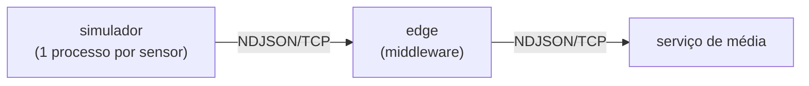

# projeto-sistemas-distribuidos
Projeto da disciplina de sistemas distribuídos.

Servidor TCP simples escrito em TypeScript com o módulo `node:net`.

## Requisitos

- Node.js >= 20 (recomendado 22+ para executar `.ts` diretamente)

## Instalação

```bash
npm install
```

## Uso

| Comando | Descrição |
| --- | --- |
| `npm run dev` | Executa `src/server.ts` direto pelo Node, com reload automático |
| `npm run build` | Compila o TypeScript para `dist/` |
| `npm start` | Executa o servidor compilado (`dist/server.js`) |
| `npm run typecheck` | Apenas verifica os tipos, sem gerar arquivos |

O servidor escuta na porta `3000` por padrão. Para trocar, use a variável de ambiente `PORT`:

```bash
PORT=8080 npm run dev
```

## Como testar

Com o servidor rodando, conecte um cliente:

```bash
node -e "const net=require('node:net');const s=net.createConnection(3000,'127.0.0.1',()=>s.write('ola\n'));s.on('data',d=>process.stdout.write(d));"
```

Ou use `telnet`/`nc`:

```bash
nc 127.0.0.1 3000
```

Ao conectar, o servidor responde com o endereço do cliente e registra no console tudo o que for recebido. Encerre com `Ctrl+C` — o servidor faz o shutdown de forma graciosa.

## Fluxo de dados



Nesta etapa o edge é um **middleware**: confere o envelope e repassa a leitura intacta para o serviço. A agregação por janela ainda não existe.

### Rodando

Em terminais separados:

```bash
npm run dev        # 1. destino final (por enquanto o servidor de log, porta 3000)
npm run edge       # 2. o edge, porta 4000

# 3. um processo por sensor — 6 no total
npm run simulador -- --sensor luz
npm run simulador -- --sensor umidade
npm run simulador -- --sensor presenca
npm run simulador -- --sensor pressao
npm run simulador -- --sensor ultrassonico
npm run simulador -- --sensor temperatura
```

Cada processo se identifica pelo `--id` (padrão `<tipo>-01`), amostra no intervalo do catálogo e reconecta sozinho se o edge cair.

**Derrube um processo e veja o resultado:** o sensor que morreu para de publicar, os outros cinco continuam e o edge segue repassando. Não existe estado compartilhado entre os processos — é falha parcial, não falha total.

| Variável | Onde | Padrão | Para que serve |
| --- | --- | --- | --- |
| `EDGE_PORT` | edge | `4000` | porta em que o edge escuta |
| `SERVICO_ADDR` | edge | `127.0.0.1:3000` | para onde o edge repassa |
| `EDGE_ADDR` | simulador | `127.0.0.1:4000` | edge de destino |

### Sobre o protocolo

As mensagens são NDJSON: um JSON por linha. O TCP **não preserva fronteiras de mensagem** — um pacote pode trazer meio JSON, ou dois JSON colados. Por isso o decodificador (`criarLeitorDeLinhas`, em `src/comum/protocolo.ts`) mantém um buffer e só entrega linhas completas. Sem ele, o sistema falharia de forma intermitente, que é o pior tipo de bug para depurar.

O edge valida o formato mínimo do envelope e **descarta o que não entende**, em vez de repassar lixo adiante. Campos desconhecidos são ignorados de propósito: é o que permite evoluir o envelope sem quebrar quem recebe. Se a `versaoSchema` for mais nova que a conhecida, o edge avisa e encaminha mesmo assim.

A semântica de entrega é **at-most-once**: sem conexão, a leitura é descartada e contabilizada. Ainda não há buffer nem reenvio — é uma decisão consciente, não um esquecimento.

## Sensores simulados

Todos os sensores são **quantitativos**: `valor` é sempre numérico, então a média de um sensor é sempre uma média aritmética simples. Presença foi modelada como *intensidade* (0 = ambiente vazio, 100 = movimento intenso) justamente para que a média continue fazendo sentido.

| Tipo | Unidade | Faixa | Intervalo | Dinâmica simulada |
| --- | --- | --- | --- | --- |
| `luz` | lux | 0–2000 | 1000 ms | ciclo dia/noite |
| `umidade` | % | 20–95 | 2000 ms | caminhada aleatória com reversão à média |
| `presenca` | % | 0–100 | 500 ms | rajadas intermitentes de movimento |
| `pressao` | hPa | 950–1050 | 5000 ms | deriva lenta em torno de 1013,25 |
| `ultrassonico` | cm | 20–400 | 250 ms | distância de repouso com obstáculo ocasional |
| `temperatura` | °C | 10–40 | 2000 ms | caminhada aleatória + ciclo térmico |

```ts
import { criarSensores } from './sensors/index.ts';

const sensores = criarSensores({ seed: 42 });

for (const sensor of sensores) {
    console.log(sensor.ler(new Date()));
}
```

A `seed` é fixa por padrão (42) para que a simulação seja reproduzível. Passe `seed: Date.now()` para variar a cada execução.

Adicionar um **tipo** novo de sensor é: uma entrada em `PERFIS_SENSORES`, uma classe que estenda `SensorBase` e um `case` em `criarSensor()`. Nem o edge nem o serviço de média precisam saber que ele existe.

Adicionar apenas outra **instância** de um tipo que já existe (um segundo sensor de temperatura, por exemplo) não precisa de código nenhum: é só subir outro processo com `--id temperatura-02`.

> Nos imports o caminho termina em `.ts` (ex.: `./sensors/index.ts`). O Node exige a extensão real do arquivo, e o `tsc` reescreve para `.js` na compilação — por isso o mesmo fonte funciona em `npm run dev` e em `npm start`.

## Estrutura

- `src/simulador.ts` — um processo por sensor: publica as leituras no edge
- `src/edge.ts` — middleware: valida o envelope e repassa para o serviço de média
- `src/server.ts` — servidor TCP de exemplo, usado como destino enquanto o serviço de média não existe
- `src/comum/`
  - `protocolo.ts` — framing NDJSON e leitura de endereço `host:porta`
  - `log.ts` — log com carimbo de horário, para correlacionar os vários processos
- `src/sensors/` — contrato e implementação dos sensores simulados
  - `sensor.ts` — interface `Sensor`, envelope `LeituraSensor` e tipos
  - `catalog.ts` — catálogo com unidade, faixa e intervalo de cada tipo
  - `base-sensor.ts` — comportamento comum (sequência, arredondamento, faixa)
  - `random.ts` — PRNG determinístico
  - `luz.ts`, `umidade.ts`, `presenca.ts`, `pressao.ts`, `ultrassonico.ts`, `temperatura.ts` — as classes
  - `index.ts` — reexporta o módulo e expõe `criarSensor()` e `criarSensores()`
- `tsconfig.json` — configuração do TypeScript
- `dist/` — saída da compilação (gerada, não versionada)

