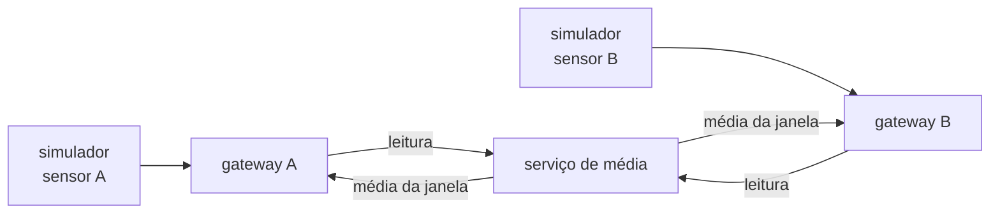

# projeto-sistemas-distribuidos
Projeto da disciplina de sistemas distribuídos.

Simulador de sensores, gateways de borda e serviço de média, conversando por TCP em TypeScript.

Cada componente roda como um processo independente, de modo que derrubar um não afeta os outros. O objetivo do desenho é que acrescentar sensores ou gateways não exija mudar o que já está rodando.

## Requisitos

- Node.js >= 20 (recomendado 22+ para executar `.ts` diretamente)

## Instalação

```bash
npm install
```

## Uso

| Comando | Descrição |
| --- | --- |
| `npm run servico` | Serviço de média: acumula por sensor e por janela |
| `npm run edge` | Gateway de borda; um por sensor, use `--porta` e `--id` |
| `npm run simulador` | Um sensor simulado; use `--sensor` |
| `npm run build` | Compila o TypeScript para `dist/` |
| `npm run typecheck` | Apenas verifica os tipos, sem gerar arquivos |
| `npm run dev` | Servidor de exemplo (`src/server.ts`), com reload automático |
| `npm start` | Servidor de exemplo compilado (`dist/server.js`) |

### Executando os componentes

`npm run servico`, `npm run edge` e `npm run simulador` executam os fontes `.ts` direto pelo Node (type stripping), sem etapa de build. Depois de `npm run build`, os equivalentes compilados são:

```bash
node dist/servico-media.js
node dist/edge.js --id gw-luz --porta 4001
node dist/simulador.js --sensor luz --edge 127.0.0.1:4001
```

`src/server.ts`, `npm run dev` e `npm start` são o servidor TCP de exemplo do começo do projeto: continuam funcionando (`PORT` muda a porta), mas não participam da cadeia.

## Fluxo de dados



**Um gateway por sensor.** Cada par sensor + gateway é independente: acrescentar um sensor é subir mais um par de processos, sem tocar no que já está rodando.

O gateway não agrega nada. Ele confere o envelope e repassa a leitura intacta. No caminho de volta, recebe do serviço a média já calculada e a **mantém em memória para exibir**.

O serviço de média acumula por sensor dentro de uma janela de tempo e responde **na mesma conexão** em que a leitura chegou. Como é o gateway que abre a conexão, o serviço não precisa conhecer o endereço de ninguém para responder — a média volta exatamente para quem mandou o dado.

### Rodando

Em terminais separados:

```bash
npm run servico   # 1. serviço de média: porta 5000, janela de 5 s

# 2. um gateway por sensor (cada um na sua porta)
npm run edge -- --id gw-luz          --porta 4001
npm run edge -- --id gw-umidade      --porta 4002
npm run edge -- --id gw-presenca     --porta 4003
npm run edge -- --id gw-pressao      --porta 4004
npm run edge -- --id gw-ultrassonico --porta 4005
npm run edge -- --id gw-temperatura  --porta 4006

# 3. o sensor de cada gateway
npm run simulador -- --sensor luz         --edge 127.0.0.1:4001
npm run simulador -- --sensor umidade     --edge 127.0.0.1:4002
npm run simulador -- --sensor presenca    --edge 127.0.0.1:4003
npm run simulador -- --sensor pressao     --edge 127.0.0.1:4004
npm run simulador -- --sensor ultrassonico --edge 127.0.0.1:4005
npm run simulador -- --sensor temperatura --edge 127.0.0.1:4006
```

Cada processo se identifica pelo `--id`, amostra no intervalo do catálogo e reconecta sozinho se o nó de cima cair. Os gateways só precisam de `--porta` distinta — nada mais muda entre eles.

**Derrube um processo e veja o resultado:** o par que morreu para de publicar, os outros cinco continuam e o serviço segue calculando as médias deles. Não existe estado compartilhado entre os pares — é falha parcial, não falha total.

| Variável | Onde | Padrão | Para que serve |
| --- | --- | --- | --- |
| `SERVICO_PORT` | serviço | `5000` | porta em que o serviço escuta |
| `JANELA_MS` | serviço | `5000` | duração da janela de agregação |
| `EDGE_PORT` | gateway | `4000` | porta de escuta (`--porta` tem precedência) |
| `SERVICO_ADDR` | gateway | `127.0.0.1:5000` | onde está o serviço de média |
| `EDGE_ADDR` | simulador | `127.0.0.1:4000` | gateway de destino |

### Sobre o protocolo

As mensagens são NDJSON: um JSON por linha. O TCP **não preserva fronteiras de mensagem** — um pacote pode trazer meio JSON, ou dois JSON colados. Por isso o decodificador (`criarLeitorDeLinhas`, em `src/comum/protocolo.ts`) mantém um buffer e só entrega linhas completas. Sem ele, o sistema falharia de forma intermitente, que é o pior tipo de bug para depurar.

O edge valida o formato mínimo do envelope e **descarta o que não entende**, em vez de repassar lixo adiante. Campos desconhecidos são ignorados de propósito: é o que permite evoluir o envelope sem quebrar quem recebe. Se a `versaoSchema` for mais nova que a conhecida, o edge avisa e encaminha mesmo assim.

A semântica de entrega é **at-most-once**: sem conexão, a leitura é descartada e contabilizada. Ainda não há buffer nem reenvio — é uma decisão consciente, não um esquecimento.

### Sobre a janela de agregação

A janela é **alinhada ao relógio absoluto** (múltiplo de `JANELA_MS` calculado sobre o `timestamp` da leitura), e não a "desde que o gateway conectou". Sem isso, dois gateways teriam janelas deslocadas e as médias não seriam comparáveis — que é justamente o que impediria acrescentar mais um nó depois.

O serviço acumula internamente **`soma` e `quantidade`**, nunca a média já dividida. É o que permite combinar janelas de tamanhos diferentes sem distorcer o resultado, e o que torna barato mover a agregação para o gateway mais tarde. A divisão acontece só na hora de responder.

A resposta traz também `minimo` e `maximo`, que saem de graça no acumulador.

Uma leitura que chegue atrasada, para uma janela já fechada, recria a entrada e provoca uma nova emissão com o número corrigido. É escolha consciente: preferimos reemitir a perder o dado.

## Sensores simulados

Todos os sensores são **quantitativos**: `valor` é sempre numérico, então a média de um sensor é sempre uma média aritmética simples. Presença foi modelada como *intensidade* (0 = ambiente vazio, 100 = movimento intenso) justamente para que a média continue fazendo sentido.

| Tipo | Unidade | Faixa | Intervalo | Dinâmica simulada |
| --- | --- | --- | --- | --- |
| `luz` | lux | 0–2000 | 1000 ms | ciclo dia/noite |
| `umidade` | % | 20–95 | 2000 ms | caminhada aleatória com reversão à média |
| `presenca` | % | 0–100 | 500 ms | rajadas intermitentes de movimento |
| `pressao` | hPa | 950–1050 | 5000 ms | deriva lenta em torno de 1013,25 |
| `ultrassonico` | cm | 20–400 | 250 ms | distância de repouso com obstáculo ocasional |
| `temperatura` | °C | 10–40 | 2000 ms | caminhada aleatória + ciclo térmico |

```ts
import { criarSensores } from './sensors/index.ts';

const sensores = criarSensores({ seed: 42 });

for (const sensor of sensores) {
    console.log(sensor.ler(new Date()));
}
```

A `seed` é fixa por padrão (42) para que a simulação seja reproduzível. Passe `seed: Date.now()` para variar a cada execução.

Adicionar um **tipo** novo de sensor é: uma entrada em `PERFIS_SENSORES`, uma classe que estenda `SensorBase` e um `case` em `criarSensor()`. Nem o edge nem o serviço de média precisam saber que ele existe.

Adicionar apenas outra **instância** de um tipo que já existe (um segundo sensor de temperatura, por exemplo) não precisa de código nenhum: é só subir outro processo com `--id temperatura-02`.

> Nos imports o caminho termina em `.ts` (ex.: `./sensors/index.ts`). O Node exige a extensão real do arquivo, e o `tsc` reescreve para `.js` na compilação — por isso o mesmo fonte funciona em `npm run dev` e em `npm start`.

## Estrutura

- `src/simulador.ts` — um processo por sensor: publica as leituras no gateway
- `src/edge.ts` — gateway: valida, repassa a leitura e guarda em memória a média que volta
- `src/servico-media.ts` — acumula por sensor e por janela de tempo e devolve a média ao gateway
- `src/server.ts` — servidor TCP de exemplo; não participa da cadeia
- `src/comum/`
  - `protocolo.ts` — framing NDJSON e leitura de endereço `host:porta`
  - `log.ts` — log com carimbo de horário, para correlacionar os vários processos
- `src/sensors/` — contrato e implementação dos `LeituraSensor` e `ResultadoMedia`, e os validadores `ehLeituraSensor`/`ehResultadoMedia`
  - `sensor.ts` — interface `Sensor`, envelope `LeituraSensor` e tipos
  - `catalog.ts` — catálogo com unidade, faixa e intervalo de cada tipo
  - `base-sensor.ts` — comportamento comum (sequência, arredondamento, faixa)
  - `random.ts` — PRNG determinístico
  - `luz.ts`, `umidade.ts`, `presenca.ts`, `pressao.ts`, `ultrassonico.ts`, `temperatura.ts` — as classes
  - `index.ts` — reexporta o módulo e expõe `criarSensor()` e `criarSensores()`
- `tsconfig.json` — configuração do TypeScript
- `dist/` — saída da compilação (gerada, não versionada)

