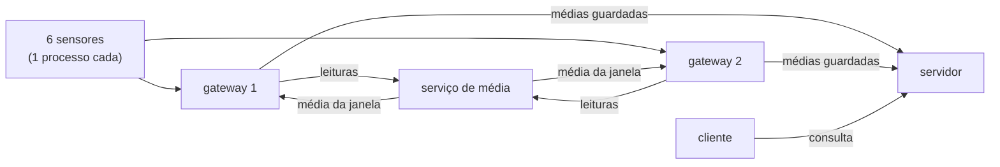

# projeto-sistemas-distribuidos
Projeto da disciplina de sistemas distribuídos.

Simulador de sensores, gateways de borda e serviço de média, conversando por TCP em TypeScript.

Cada componente roda como um processo independente, de modo que derrubar um não afeta os outros. O objetivo do desenho é que acrescentar sensores ou gateways não exija mudar o que já está rodando.

## Requisitos

- Node.js >= 20 (recomendado 22+ para executar `.ts` diretamente)

## Instalação

```bash
npm install
```

## Uso

| Comando | Descrição |
| --- | --- |
| `npm run servico` | Serviço de média: calcula a média da janela e devolve ao gateway |
| `npm run servidor` | Servidor: recebe as médias dos gateways e atende o cliente |
| `npm run edge` | Gateway de borda; use `--id` e `--porta` |
| `npm run simulador` | Um sensor simulado; use `--sensor` |
| `npm run consultar` | Cliente: exibe o histórico das médias |
| `npm run build` | Compila o TypeScript para `dist/` |
| `npm run typecheck` | Apenas verifica os tipos, sem gerar arquivos |
| `npm run dev` | Servidor, com reload automático |
| `npm start` | Servidor compilado (`dist/server.js`) |

### Executando os componentes

Os scripts rodam os fontes `.ts` direto pelo Node (type stripping), sem etapa de build. Depois de `npm run build`, os equivalentes compilados são:

```bash
node dist/servico-media.js
node dist/server.js
node dist/edge.js --id gw-1 --porta 4001
node dist/simulador.js --sensor luz --edge 127.0.0.1:4001
node dist/consultar.js
```

## Fluxo de dados



Quatro papéis, cada um com uma responsabilidade:

| Componente | Faz | Não faz |
| --- | --- | --- |
| sensor | emite leituras no intervalo do catálogo | não conhece o resto |
| gateway | pede a média ao serviço, guarda em memória, envia ao servidor | não calcula |
| serviço | calcula a média da janela e devolve ao gateway | não fala com cliente |
| servidor | consolida o que recebe dos gateways e atende o cliente | não calcula |

O gateway não agrega nada: confere o envelope e repassa a leitura intacta. O que ele guarda é a **média** que volta do serviço — as últimas `HISTORICO_TAMANHO` janelas de cada sensor.

Um gateway atende até 4 sensores, apontados por `--edge`. Mover um sensor de um gateway para outro não muda uma linha de código.

Ao (re)conectar no servidor, o gateway envia o histórico inteiro. Como a memória dele é a fonte de verdade dos seus sensores, o servidor se reconstrói sozinho depois de um reinício.

### Rodando

Em terminais separados:

```bash
npm run servico
npm run servidor

npm run edge -- --id gw-1 --porta 4001
npm run edge -- --id gw-2 --porta 4002   

npm run simulador -- --sensor luz          --edge 127.0.0.1:4001
npm run simulador -- --sensor umidade      --edge 127.0.0.1:4001
npm run simulador -- --sensor presenca     --edge 127.0.0.1:4001
npm run simulador -- --sensor ultrassonico --edge 127.0.0.1:4001
npm run simulador -- --sensor pressao      --edge 127.0.0.1:4002
npm run simulador -- --sensor temperatura  --edge 127.0.0.1:4002
```

A consulta fala **só com o servidor**, em `127.0.0.1:6000`:

```bash
npm run consultar
npm run consultar -- --sensor luz-01
npm run consultar -- --json
```

A divisão 4 + 2 é só uma escolha. Nada no código depende dela: qualquer sensor pode apontar para qualquer gateway.

Cada processo se identifica pelo `--id`, amostra no intervalo do catálogo e reconecta sozinho se o nó de cima cair.

**Derrube um processo e veja o resultado:** derrubar um sensor para só a média dele, e o gateway continua atendendo os outros. Derrubar um gateway para as médias dos sensores daquele gateway — os outros seguem, e o serviço continua calculando.

Esse é o trade-off da concentração: menos gateways significa menos processos e menos conexões para administrar, mas cada falha atinge mais sensores de uma vez.

| Variável | Onde | Padrão | Para que serve |
| --- | --- | --- | --- |
| `SERVICO_PORT` | serviço | `5000` | porta em que o serviço escuta |
| `JANELA_MS` | serviço | `5000` | duração da janela de agregação |
| `SERVIDOR_PORT` | servidor | `6000` | porta em que o servidor escuta |
| `HISTORICO_TAMANHO` | gateway, servidor | `20` | quantas janelas cada sensor guarda |
| `EDGE_PORT` | gateway | `4000` | porta de escuta (`--porta` tem precedência) |
| `SERVICO_ADDR` | gateway | `127.0.0.1:5000` | onde está o serviço de média |
| `SERVIDOR_ADDR` | gateway, cliente | `127.0.0.1:6000` | onde está o servidor |
| `EDGE_ADDR` | simulador | `127.0.0.1:4000` | gateway de destino |

### Sobre o protocolo

As mensagens são NDJSON: um JSON por linha. O TCP **não preserva fronteiras de mensagem** — um pacote pode trazer meio JSON, ou dois JSON colados. Por isso o decodificador (`criarLeitorDeLinhas`, em `src/comum/protocolo.ts`) mantém um buffer e só entrega linhas completas. Sem ele, o sistema falharia de forma intermitente, que é o pior tipo de bug para depurar.

O edge valida o formato mínimo do envelope e **descarta o que não entende**, em vez de repassar lixo adiante. Campos desconhecidos são ignorados de propósito: é o que permite evoluir o envelope sem quebrar quem recebe. Se a `versaoSchema` for mais nova que a conhecida, o edge avisa e encaminha mesmo assim.

A semântica de entrega é **at-most-once**: sem conexão, a leitura é descartada e contabilizada. Ainda não há buffer nem reenvio — é uma decisão consciente, não um esquecimento.

### Sobre a janela de agregação

A janela é **alinhada ao relógio absoluto** (múltiplo de `JANELA_MS` calculado sobre o `timestamp` da leitura), e não a "desde que o gateway conectou". Sem isso, dois gateways teriam janelas deslocadas e as médias não seriam comparáveis — que é justamente o que impediria acrescentar mais um nó depois.

O serviço acumula internamente **`soma` e `quantidade`**, nunca a média já dividida. É o que permite combinar janelas de tamanhos diferentes sem distorcer o resultado, e o que torna barato mover a agregação para o gateway mais tarde. A divisão acontece só na hora de responder.

A resposta traz também `minimo` e `maximo`, que saem de graça no acumulador.

Uma leitura que chegue atrasada, para uma janela já fechada, recria a entrada e provoca uma nova emissão com o número corrigido. É escolha consciente: preferimos reemitir a perder o dado.

## Sensores simulados

Todos os sensores são **quantitativos**: `valor` é sempre numérico, então a média de um sensor é sempre uma média aritmética simples. Presença foi modelada como *intensidade* (0 = ambiente vazio, 100 = movimento intenso) justamente para que a média continue fazendo sentido.

| Tipo | Unidade | Faixa | Intervalo | Dinâmica simulada |
| --- | --- | --- | --- | --- |
| `luz` | lux | 0–2000 | 1000 ms | ciclo dia/noite |
| `umidade` | % | 20–95 | 2000 ms | caminhada aleatória com reversão à média |
| `presenca` | % | 0–100 | 500 ms | rajadas intermitentes de movimento |
| `pressao` | hPa | 950–1050 | 5000 ms | deriva lenta em torno de 1013,25 |
| `ultrassonico` | cm | 20–400 | 250 ms | distância de repouso com obstáculo ocasional |
| `temperatura` | °C | 10–40 | 2000 ms | caminhada aleatória + ciclo térmico |

```ts
import { criarSensores } from './sensors/index.ts';

const sensores = criarSensores({ seed: 42 });

for (const sensor of sensores) {
    console.log(sensor.ler(new Date()));
}
```

A `seed` é fixa por padrão (42) para que a simulação seja reproduzível. Passe `seed: Date.now()` para variar a cada execução.

Adicionar um **tipo** novo de sensor é: uma entrada em `PERFIS_SENSORES`, uma classe que estenda `SensorBase` e um `case` em `criarSensor()`. Nenhum outro componente precisa saber que ele existe.

Adicionar apenas outra **instância** de um tipo que já existe (um segundo sensor de temperatura, por exemplo) não precisa de código nenhum: é só subir outro processo com `--id temperatura-02`.

> Nos imports o caminho termina em `.ts` (ex.: `./sensors/index.ts`). O Node exige a extensão real do arquivo, e o `tsc` reescreve para `.js` na compilação — por isso o mesmo fonte funciona em `npm run dev` e em `npm start`.

## Estrutura

- `src/simulador.ts` — um processo por sensor: publica as leituras no gateway
- `src/edge.ts` — gateway: pede a média ao serviço, guarda o histórico e envia ao servidor
- `src/servico-media.ts` — calcula a média por sensor e por janela e devolve ao gateway
- `src/server.ts` — servidor: consolida o que vem dos gateways e atende o cliente
- `src/consultar.ts` — cliente que exibe o histórico das médias
- `src/comum/`
  - `contrato.ts` — todas as mensagens do protocolo e os seus validadores
  - `protocolo.ts` — framing NDJSON e leitura de endereço `host:porta`
  - `log.ts` — log com carimbo de horário, para correlacionar os vários processos
- `src/sensors/` — interface e implementação dos sensores
  - `sensor.ts` — interface `Sensor`
  - `catalog.ts` — catálogo com unidade, faixa e intervalo de cada tipo
  - `base-sensor.ts` — comportamento comum (sequência, arredondamento, faixa)
  - `random.ts` — PRNG determinístico
  - `luz.ts`, `umidade.ts`, `presenca.ts`, `pressao.ts`, `ultrassonico.ts`, `temperatura.ts` — as classes
  - `index.ts` — reexporta o módulo e expõe `criarSensor()` e `criarSensores()`
- `tsconfig.json` — configuração do TypeScript
- `dist/` — saída da compilação (gerada, não versionada)

